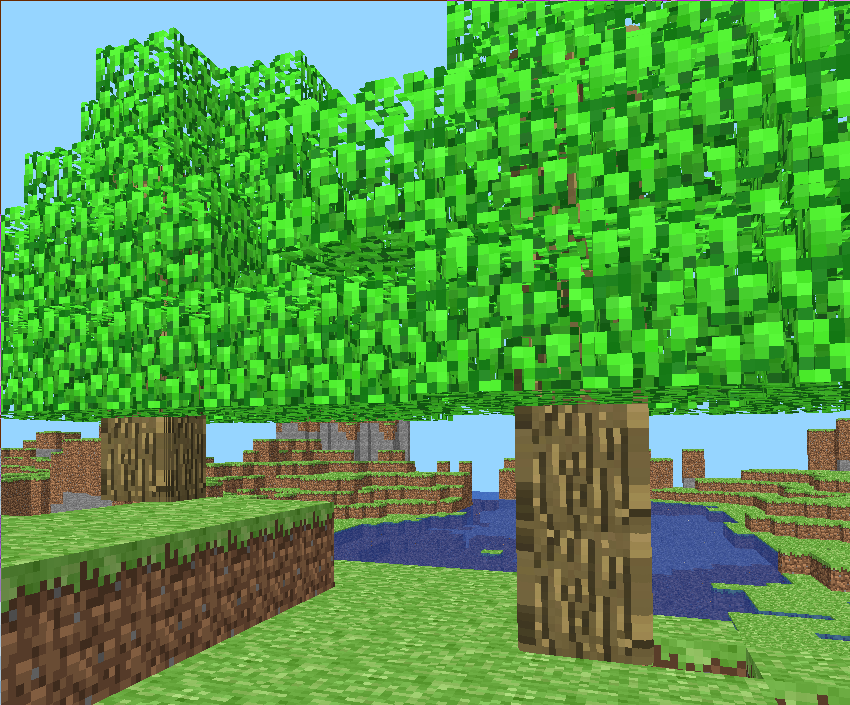

# miniMinecraft

Check out our project presentation [here](https://1drv.ms/b/s!Ag19CWltXwmGommqKjemeFrzG8hb?e=bjKTn1)!

miniMinecraft is an C/OpenGL implementation of a Minecraft-like game. Basic features include:

* Building with block placement/destruction
* Basic physics
* Map generation
* Performance optimizations (can run on integrated GPUs like the Intel HD graphics series)

## Screenshots





## Installation

### Dependencies

To install all dependencies, just do:
```sh
git submodule update --init
```

To build the projet:
```sh
mkdir -p cmake-build
cd cmake-build
cmake ..
make
```
